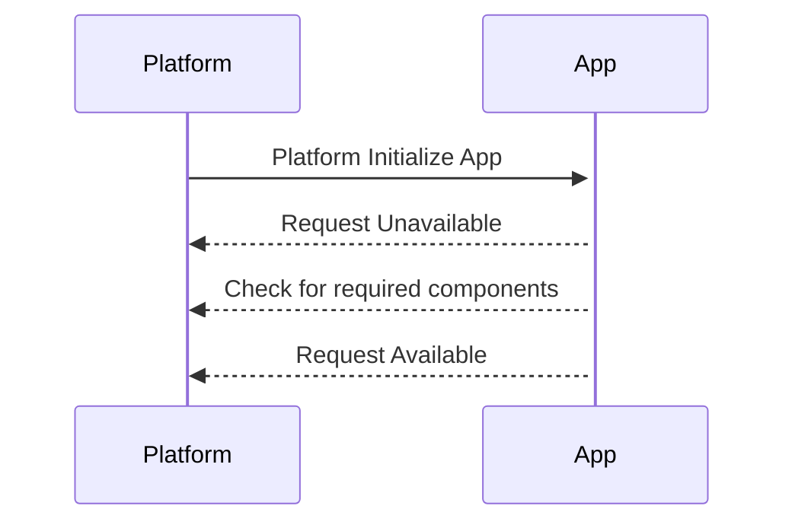
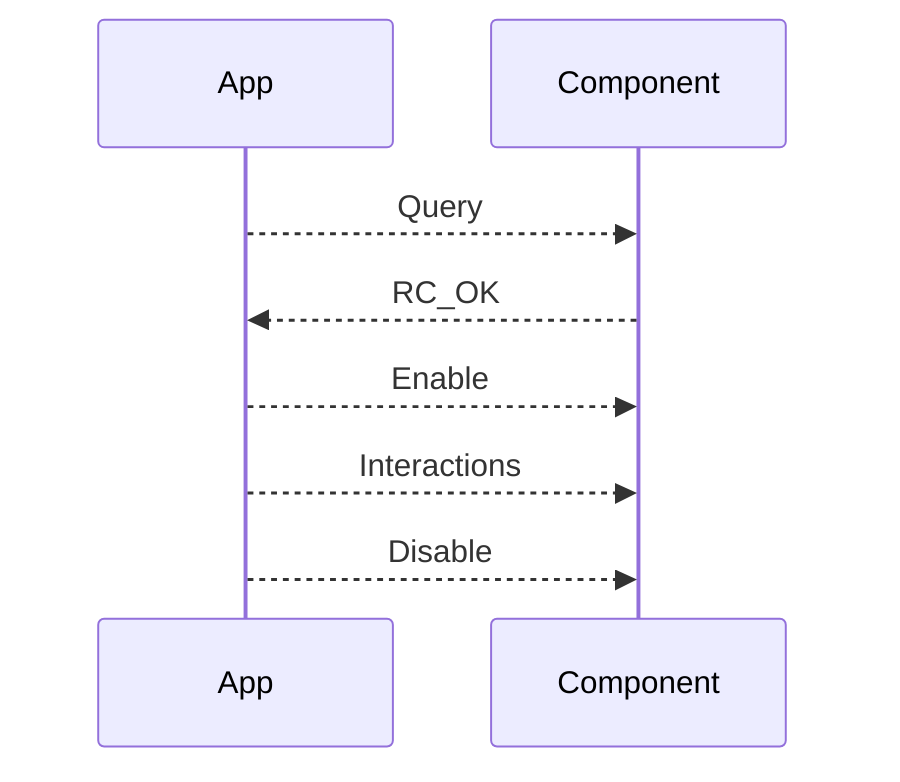

# CUSS2.ts for Deno

This is a Deno-compatible port of the CUSS2.js TypeScript SDK for interacting
with a CUSS (Common Use Self-Service) 2.0 platform. It facilitates developing
applications for self-service check-in, self-tagging, and self bag-drop in the
airline industry.

## Usage

```typescript
import { Cuss2 } from "https://deno.land/x/cuss2/mod.ts";

// Connect to the CUSS2 platform
const cuss2 = await Cuss2.connect(
  "wss://your-cuss-platform-url",
  "https://your-oauth-url",
  "your-device-id",
  "your-client-id",
  "your-client-secret",
);

// Query a component
await cuss2.boardingPassPrinter.query();

// Enable a component
await cuss2.barcodeReader.enable();

// Listen for barcode data events
cuss2.barcodeReader.on("data", (data) => {
  console.log("Barcode scanned:", data);
});

// State transitions
await cuss2.requestUnavailableState();
await cuss2.requestAvailableState();
await cuss2.requestActiveState();
```

## Core Components

1. **Cuss2**: The main class that provides an interface to the CUSS2 platform.
   - Handles platform state management
   - Manages component interactions
   - Exposes device/component methods

2. **Connection**: Manages WebSocket communication with the CUSS2 platform.
   - Handles authentication via OAuth
   - Manages WebSocket lifecycle
   - Sends/receives messages to/from the platform

3. **Component Model**: Provides interfaces for various CUSS2 peripheral
   devices:
   - BagTagPrinter
   - BoardingPassPrinter
   - BarcodeReader
   - CardReader
   - DocumentReader
   - and others

## State Transitions

One of the most important aspects in a CUSS platform is the ability to
transition between application states correctly. The library provides simple
event-based mechanisms to handle these transitions.



```ts
// CUSS Transitions

// Instantiating a connection
const cuss2 = await Cuss2.connect(
  cuss2URL,
  oauthURL,
  deviceID,
  clientId,
  clientSecret,
);

// Moving to unavailable
await cuss2.requestUnavailableState();

// checking for a ATB Printer
if (cuss2?.boardingPassPrinter) {
  // Moving to Available
  await cuss2.requestAvailableState();
}

// Listen for activation events
cuss2._stateChangeEmitter.on("activated", () => {
  console.log("Application is active");
});

// Listen for deactivation events
cuss2._stateChangeEmitter.on("deactivated", () => {
  console.log("Application is no longer active");
});
```

### Interacting with CUSS Devices

The library provides a simple and intuitive interface to interact with common
CUSS devices, that enable developer to develop complex platform interactions
without any unnecessary boilerplate.



#### Media Outputs

```ts
const cuss2 = await Cuss2.connect(cuss2URL, oauthURL, deviceID, clientId, clientSecret);

// query ATB
 const res = await cuss2?.boardingPassPrinter.query();

 // validate component state
 if (res.meta.componentState !== ComponentState.READY) {
    console.log('Component is not ready')
 } else {

  // Enable component
  await cuss2.boardingPassPrinter.enable();

  // SETUP ATB
  await cuss2.boardingPassPrinter.setup(<PECTAB>);

  // Print boarding pass
  await cuss2.boardingPassPrinter.send(<PECTAB>);

  // Helper function to do both setup and send
  await cuss2.boardingPassPrinter.setupAndPrintRaw([<PECTAB_ARRAY>], <STREAM>);

  // Disable component
  await cuss2.boardingPassPrinter.disable();
 }
```

#### Media Input

```ts
const cuss2 = await Cuss2.connect(
  cuss2URL,
  oauthURL,
  deviceID,
  clientId,
  clientSecret,
);

// query component
const res = await cuss2?.barcodeReader.query();

// validate component state
if (res.meta.componentState !== ComponentState.READY) {
  console.log("Component is not ready");
} else {
  // Enable component
  await cuss2.barcodeReader.enable();

  // Listen for barcode data events
  cuss2.barcodeReader.on("data", (data) => {
    console.log(`Barcode Data ${data}`);

    // Disable component
    cuss2.barcodeReader.disable();
  });
}
```

## License

MIT
